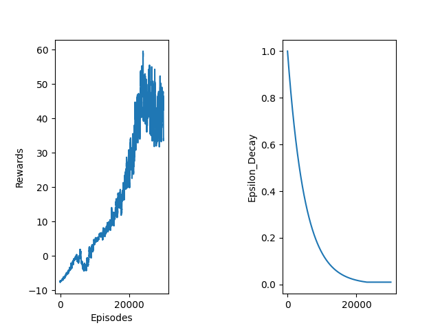

# Flappy Bird — Deep Q-Network (DQN)

A reinforcement learning agent trained to play Flappy Bird using DQN and its variants, built from scratch in PyTorch.

## Results

The agent achieves a **rolling average reward of ~60** after ~30,000 episodes, compared to ~12.5 with the baseline configuration — a 4× improvement.



## Architecture

- **Double DQN** — decouples action selection from Q-value evaluation to reduce overestimation bias
- **Dueling DQN** — splits the network into separate value and advantage streams for more stable learning
- **Experience Replay** — uniform sampling from a replay buffer of 50,000 transitions
- **Target Network** — synced every 1,000 steps for stable Q-targets

## Hyperparameters

| Parameter | Value |
|-----------|-------|
| Replay buffer size | 50,000 |
| Mini-batch size | 64 |
| Epsilon init | 1.0 |
| Epsilon decay | 0.9998 |
| Epsilon min | 0.01 |
| Learning rate | 0.00005 |
| Discount factor (γ) | 0.99 |
| Target network sync | every 1,000 steps |
| FC1 nodes | 256 |

## Installation

```bash
pip install -r requirements.txt
```

## Usage

```bash
python agent.py
```

## Project Structure
```
├── agent.py              # Training loop, epsilon-greedy policy, logging
├── dqn.py                # Neural network (Dueling DQN architecture)
├── experience.py         # Replay buffer implementation
├── hyperparameter.yml    # All tunable hyperparameters
└── runs/                 # Saved model weights and training plots
```
## Key Learnings

- Replay buffer size critically affects stability — 10,000 caused catastrophic forgetting; 50,000 resolved it
- DQN's overestimation bias can act as accidental optimism in sparse reward environments
- Double + Dueling DQN combined significantly outperformed either variant alone
- Slow epsilon decay (0.9998) was key to sustained improvement over 30,000 episodes
